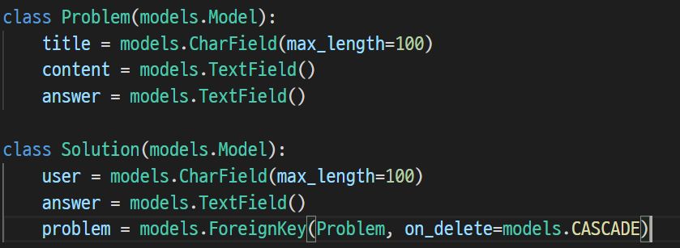

# 코딩 테스트 채점 서버 만들기(구현완료 및 프로젝트 적용)

## 1. API 서버 구현

1. Django restframework를 통해 구현하였으며, Postman 사용

- 필요한 필드 구상
  - 문제 : 문제, input/output, 정답
  - 사용자 풀이 : 사용자 / 코드 / 문제(FK)




- 명세에서 요구하는 JSON 형식 {user : "김현송", "answer:  some awesome code"}
- serializer에서 FK 필드를 재정의 하여 구현


- api 요청은 postman을 사용


2. 채점 데이터 프리셋

- 문제 구상 
  - 어려운 문제를 구현하기보다 기본적인 문제를 실험값으로 잡고 테스트를 진행
    - 문) a + b
  - TC input 값 임의로 설정


3. 정답 여부 판별 및 채점 모듈

- 사용자로 받은 json 데이터를 python 파일로 저장
- 파일을 readline()으로 읽어 ""(comma)제거
- exec 함수를 만들어 readline으로 읽은 문자열을 리스트로 만들어 '\n'으로 join해서 읽음
  - 주의할 점 : exec 함수는 return 값이 없기때문에 세번째 파라미터인 locals()는 반드시 dict type이어야 반환값을 설정할 수 있음.


- input파일을 sys.stdin(standard input)으로 실행함
- 정답 개수를 확인하여 맞았을 경우 pass 틀렸을 경우 맞은 개수를 data에 담아 response로 보냄


 ※ 아직 구현하지 못한 점

- 문제는 출력값을 요구하는데 출력값에 대한 접근을 어떠한 방식으로 해야할지 모르겠음

  - 이를 테면 사용자가 코드를 다음과 같이 입력한다면

  ```python
  #...(생략)
  answer = a + b
  print(answer)
  ```

  로 변수에 대한 접근이 가능해 key로 만들어 사용할 수 있으나

  ```python
  #...(생략)
  print(a + b)
  ```

  의 경우는 연산한 결과값을 출력하기 때문에 이에대한 접근이 어려움.


​	=> 해결 방법 (이 사실 딱히 떠오르지 않아서...): print 한 값을 그대로 텍스트 파일로 저장하여 output.txt와 비교하는 것이다.


- 컴파일한 결과를 실행하고자 컴파일 함수를 만들어 시행해 보았는데 다음과 같은 결과가 출력됨.

  

​	시행할때마다 다른 결과가 출력됨.


아래의 오류는 서버와 클라이언트 각각에서 IDLE를 실행하라는 오류이다

- 같은 idle.exe 프로그램에서 서버를 먼저 구동한 다음 클라이언트로 접속을 시도하면 먼저 실행된 서버 스크립트가 닫혀 개별적으로 실행해야한다.
